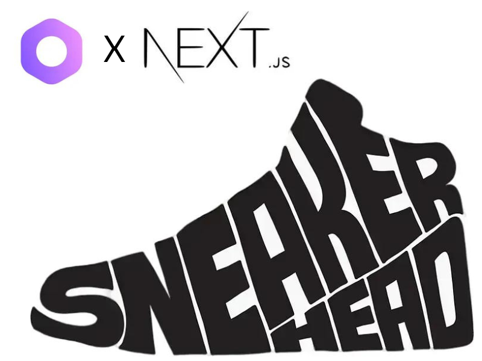

## SneakerHead-Store

### Cover Image
</img>
<br/>
#### A E-commerce WebFront Store for Sneaker & Shoe lovers, build using MedusaJS and NEXT.js 

### Demo Link

The Project isn't hosted but a screen recording of the project working is attached below: <br/>
https://user-images.githubusercontent.com/64676594/195950378-61a5f101-88c2-4412-97b6-284cbb63c33f.mp4

## About

### Participants

Github : [@abhijeet007rocks8](https://github.com/abhijeet007rocks8) [@manisha-27](https://github.com/manisha-27)

Twitter : [@Abhijeet Chatterjee](https://twitter.com/Abhijee58090064) [@Manisha Singh](https://twitter.com/Manisha87672782)

Discord : Abhijeet#1624  ||  Macsia#7113

### Description

We have created a **Web-Storefront for Sneakers and Sports Shoes** <br/> 
using NextJs paired with MedusaJs

### Preview

#### GIFs
- HomePage <br/><br/>

- Products and Adding to Cart <br/><br/>

- Price Change On Choosing different Combination <br/><br/>

- Cart and Sign-In to account <br/><br/>

- Cart and Checkout Page <br/><br/>


#### ScreenShots of Projects


## Set up Project

### Prerequisites

If running your submission requires any prerequisites, make sure to list them in this section.

Examples of Prerequisites:

- Medusa CLI (```npm install -g @medusajs/medusa-cli```) .
- Node (https://node.org/)
- yarn (https://yarnpkg.com/)

### Install Project

1. Clone the repository:

```bash
git clone https://github.com/abhijeet007rocks8/SportsFactory.git
```

2. Change directory and install dependencies:

```bash
cd SneakerHead-Store
cd Backend
medusa develop
```
Open another terminal using path of cloned repository
```bash
cd frontend 
yarn install
yarn dev
```

3. (Optional)<br/>
To setup a new store 
```bash
medusa new my-medusa-store --seed
```

To use exiting Seed file in DB
```bash
medusa seed -f ./data/seed.json
```

## Resources
Here are some resourves and documenatations that were very useful while making this project :

- [Medusa’s GitHub repository](https://github.com/medusajs/medusa)
- [How to Create Services](https://docs.medusajs.com/advanced/backend/services/create-service)
- [NextJs](https://nextjs.org/)
